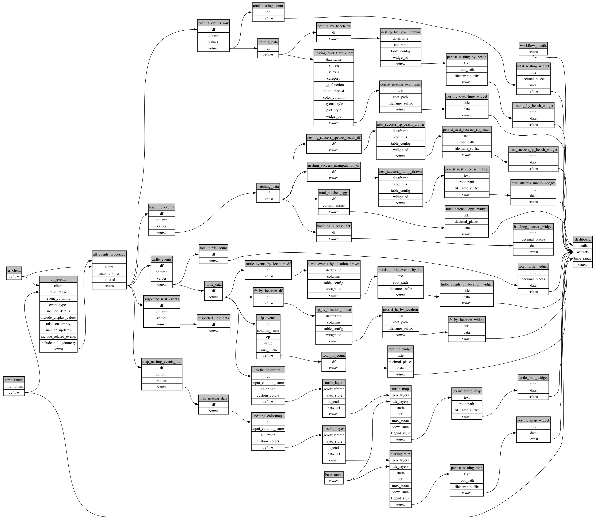

```
# AUTOGENERATED BY ECOSCOPE-WORKFLOWS; see fingerprint in README.md for details

```

```yaml
# fingerprint:
artifacts_sha256_basic: 7e214beb3a26670e7df85b21df5a9fbb683931bfb3a630af00d6881c1812b0df
artifacts_sha256_strict: 8878d1598fad6f36f7e4340594510a516d8ff382055ea6e7ef1ee8607ded4c18
installed_requirements:
- channel: https://repo.prefix.dev/ecoscope-workflows/
  name: ecoscope-workflows-core
  version: {version: ==0.22.18}
- channel: https://repo.prefix.dev/ecoscope-workflows/
  name: ecoscope-workflows-ext-ecoscope
  version: {version: ==0.22.18}
- channel: https://repo.prefix.dev/ecoscope-workflows-custom/
  name: ecoscope-workflows-ext-custom
  version: {version: ==0.0.56}
- channel: conda-forge
  name: pydeck
  version: {version: ==0.9.2}
- channel: file:///tmp/ecoscope-workflows-custom/release/artifacts/
  name: ecoscope-workflows-ext-curacao
  version: {version: ==0.0.0}
params_sha256: b7d7fbbcf92682196fc6fd61b5b05984a0830c45b4050b4e84787d578504f465
spec_sha256: 387724b4f46a352e7827c98f2fa3e66e835da7ffbfc68ee3e170bb6baa779804

```

# ecoscope-workflows-turtle-monitoring-workflow


