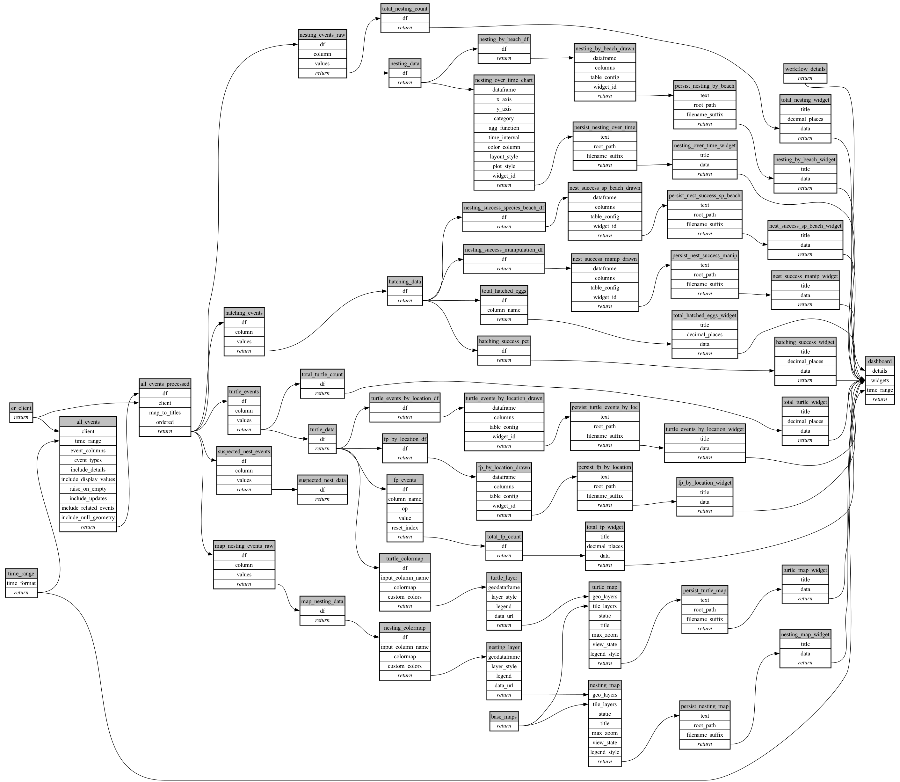

```
# AUTOGENERATED BY ECOSCOPE-WORKFLOWS; see fingerprint in README.md for details

```

```yaml
# fingerprint:
artifacts_sha256_basic: 664bb686d236aedc4f02411dd0bfecd2e604d33d9caf65869da2c88a5665e8cb
artifacts_sha256_strict: 69b6016ecce41f1ae91871fb1e5eb32b5f5090f0de097de710bf36e191ff36f8
installed_requirements:
- channel: https://repo.prefix.dev/ecoscope-workflows/
  name: ecoscope-platform
  version: {version: ==2.16.1}
- channel: https://repo.prefix.dev/ecoscope-workflows-custom/
  name: ecoscope-workflows-ext-custom
  version: {version: ==0.1.0rc15}
- channel: conda-forge
  name: pydeck
  version: {version: ==0.9.2}
- channel: file:///tmp/ecoscope-workflows-custom/release/artifacts/
  name: ecoscope-workflows-ext-curacao
  version: {version: ==0.0.0}
params_sha256: c02dd59dab48ac6f95de2521d57c35fae165883c11ca5a57f1cab8ecfd45a499
spec_sha256: 4bb4d374a41d897d35e4a6266e551dcec4bf517469f06e143429c192f751fc15

```

# wt-turtle-monitoring-workflow


